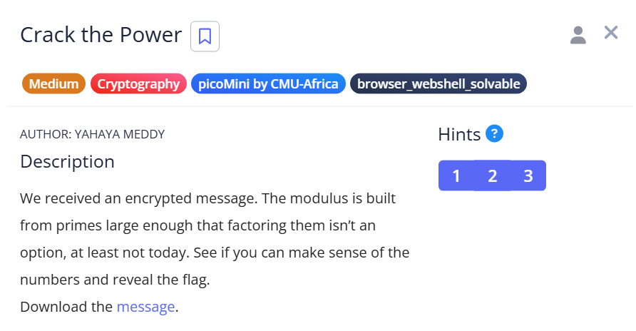

# Crack the Power

## Summary

| Item | Details |
|-|-|
| Category | Cryptograghy |
| Difficulty | Medium |
| Link | https://play.picoctf.org/practice/challenge/522 |

## Challenge



## Solution Steps

1. **Download the message**
   ```sh
   wget https://challenge-files.picoctf.net/c_amiable_citadel/fddf51f15bd9f4145c4a4ebee5dfe7994bdab6393453f41f02c59cfd23a87fda/message.txt
   ```

2. **Coppersmith method**
   As hinted in the CTF challenge, this is related to Coppersmith's attack: https://en.wikipedia.org/wiki/Coppersmith%27s_attack

   In normal RSA:
   ```
   c ≡ m^e (mod n)
   ```
   But if the message is small enough such that:
   ```
   m^e < n
   ```
   then no modulo reduction occurs, and:
   ```
   c = m^e
   ```
   
4. **Create a test .py using nano**
   ```sh
   import gmpy2

   c = 6406374308104068575005667020962740842386353182361792134741714717629629240311434067717625885909023964707559165296004043660171788566265047412641002469777701931779823
   e = 20

   m,exact = gmpy2.iroot(c,e) #m is the numeric representation of the message, not yet human-readable
   hex_m = hex(m)[2:]  # remove '0x' prefix
   if len(hex_m) % 2:
       hex_m = '0' + hex_m  # make even number of digits
   msg_bytes = bytes.fromhex(hex_m)
   msg_text = msg_bytes.decode()
   print(msg_text)
   ```

## Flag

`picoCTF{t1ny_e_f053d79c}`
